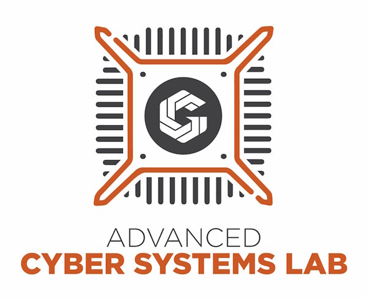

# Podcast Studio Checklist

## Personal Items

- [ ] A flash drive, at least 16gb, more if longer than 15 minutes
- [ ] Arrive 15 minutes early to allow for prep time. 

## Room prep

- [ ] Turn on equipment
  - [ ] Mac Computers
    - Power button located left hand rear about finger length from bottom corner
  - [ ] Mackie DLZ Creator
    - Power switch located right hand rear about center up
- [ ] Login to Mac
  - Password: toor
- [ ] Open relevant programs on the main Mac
  - [ ] Open Broadcast Studio (OBS)
    - Located in the bottom right of the screen with the circle three section logo
- [ ] Select relevant scene in OBS
- [ ] Remove Razer webcam lens cap
- [ ] Check that cameras are positioned as expected
- [ ] Check that audio is output to the headphones
- [ ] Check that audio is output to OBS 
- [ ] Get all relevant parties in the room
- [ ] Shut door fully
- [ ] Wear headphones
- [ ] Position microphones in front of speakers

## Test Recording
- [ ] In OBS click the start recording button 
- [ ] Test by
  - [ ] Speaking
  - [ ] Moving on camera or on screen
  - [ ] changing scenes within OBS
- [ ] Click the stop recording button
- [ ] In finder, in the movies directory, view and listen to the newest movie. 
- [ ] If happy with the result continue, otherwise ask a lab employee for help. 

## Start Recording
- [ ] In OBS click the start recording button

## Stop recording
- [ ] In OBS click the stop recording button
- [ ] Place headphones back on stands

## Copying your recording
- [ ] Plug in the Flash drive you brought to the usb c hub on the base/stand of the Mac
- [ ] Open Finder for files
- [ ] Copy the most recent video from the videos folder to your flash drive
- [ ] Once copied safely eject the flash drive
- [ ] Remove from the Mac

## Leaving the room
 - [ ] Put Razer lens cap back on Razer webcam
 - [ ] Turn off devices
   - [ ] Mac Computers
   - [ ] Mackie DLZ Creator

 ### Any questions on process please ask one of the workers for the ACSL. 

